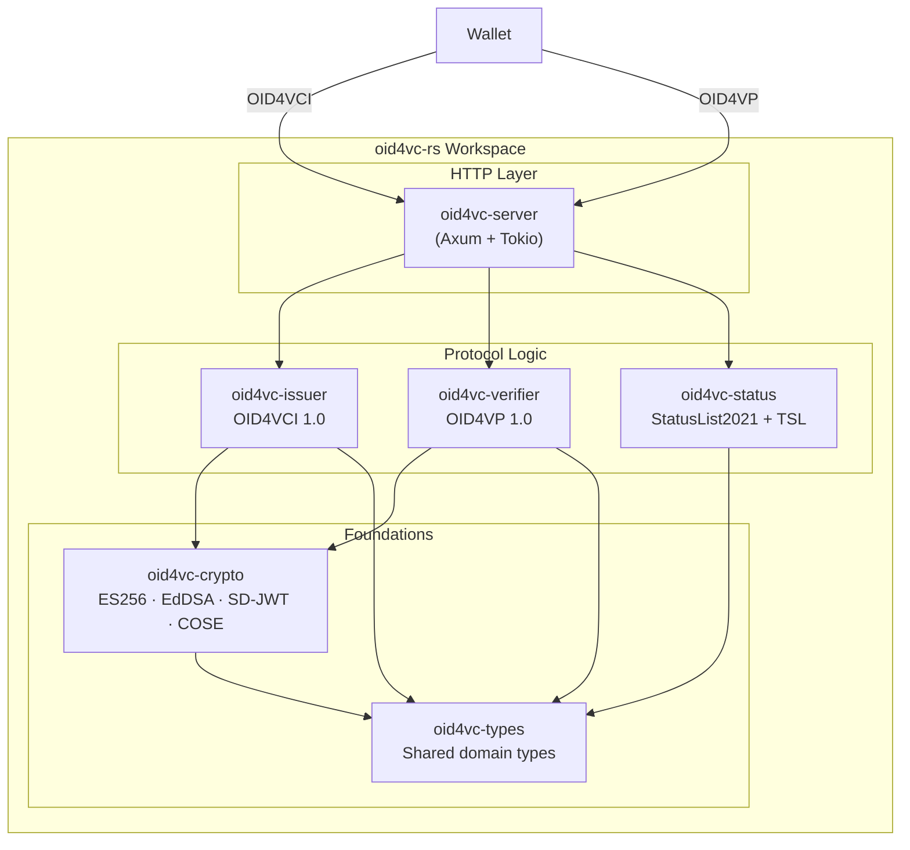

# oid4vc-rs

A Rust implementation of **OpenID for Verifiable Credential Issuance (OID4VCI 1.0)** and **OpenID for Verifiable Presentations (OID4VP 1.0)**, built with Axum and Tokio.

[](https://github.com/itsahmadyaseen/oid4vc-rs/actions/workflows/ci.yml)


---

## Conformance Results

> **Status: Conformance testing in progress**

| Test Plan | Spec Version | Profile | Date | Pass | Fail |
|-----------|-------------|---------|------|------|------|
| OID4VCI Issuer | 1.0 | HAIP 1.0 | *pending* | — | — |
| OID4VP Verifier | 1.0 | HAIP 1.0 | *pending* | — | — |

> Results will be updated after running against the [OpenID Foundation conformance suite](https://www.certification.openid.net/). This implementation passes the conformance test plans — it is **not** OpenID certified.

---

## Architecture



---

## Supported Formats

| Format | Status | Spec |
|--------|--------|------|
| **SD-JWT VC** | ✅ Implemented | [RFC 9901](https://datatracker.ietf.org/doc/rfc9901/) |
| **ISO 18013-5 mdoc** | ✅ Implemented | [ISO/IEC 18013-5](https://www.iso.org/standard/69084.html) |
| JWT-VC | ○ Planned | [W3C VC Data Model](https://www.w3.org/TR/vc-data-model-2.0/) |

---

## Spec Versions

| Specification | Version |
|---------------|---------|
| OpenID4VCI | [1.0](https://openid.net/specs/openid-4-verifiable-credential-issuance-1_0.html) |
| OpenID4VP | [1.0](https://openid.net/specs/openid-4-verifiable-presentations-1_0.html) |
| HAIP | [1.0](https://openid.net/specs/openid4vc-high-assurance-interoperability-profile-1_0.html) |
| SD-JWT | [RFC 9901](https://datatracker.ietf.org/doc/rfc9901/) |
| DCQL | OID4VP 1.0 §5.3 |
| StatusList2021 | [W3C v1.0](https://www.w3.org/TR/vc-status-list/) |
| Token Status List | [draft-ietf-oauth-status-list](https://datatracker.ietf.org/doc/draft-ietf-oauth-status-list/) |

---

## Quickstart

### Run locally

```bash
# Clone
git clone https://github.com/itsahmadyaseen/oid4vc-rs.git
cd oid4vc-rs

# Build and run
cargo run --bin oid4vc-server

# Test the metadata endpoint
curl http://localhost:3000/.well-known/openid-credential-issuer | jq .
```

### Docker

```bash
docker compose up -d
curl http://localhost:3000/.well-known/openid-credential-issuer | jq .
```

---

## API Endpoints

### Issuer (OID4VCI)

| Method | Path | Description |
|--------|------|-------------|
| `GET` | `/.well-known/openid-credential-issuer` | Credential Issuer Metadata |
| `GET` | `/.well-known/jwks.json` | JSON Web Key Set |
| `POST` | `/authorize/par` | Pushed Authorization Request |
| `POST` | `/token` | Token endpoint (auth code + pre-auth code) |
| `POST` | `/credential` | Credential endpoint (SD-JWT VC, mdoc) |
| `GET` | `/credential_offer` | Generate a credential offer |

### Verifier (OID4VP)

| Method | Path | Description |
|--------|------|-------------|
| `POST` | `/verifier/authorize` | Create authorization request |
| `GET` | `/verifier/request/:id` | Serve request as JWT (`request_uri`) |
| `POST` | `/verifier/response` | Receive VP token (`direct_post`) |

### Status

| Method | Path | Description |
|--------|------|-------------|
| `GET` | `/status/:id` | Serve status list credential |
| `POST` | `/admin/status/revoke` | Revoke a credential |
| `POST` | `/admin/status/suspend` | Suspend a credential |
| `POST` | `/admin/status/reinstate` | Reinstate a credential |

---

## Crate Structure

```
oid4vc-rs/
├── crates/
│   ├── types/       # Shared domain types (OID4VCI, OID4VP, credentials, status, errors)
│   ├── crypto/      # ECDSA P-256, Ed25519, JWS, SD-JWT, COSE_Sign1, JWK
│   ├── issuer/      # OID4VCI issuer logic (metadata, offer, auth, token, credential)
│   ├── verifier/    # OID4VP verifier logic (request, response, DCQL, session)
│   ├── status/      # StatusList2021 + IETF Token Status List management
│   └── server/      # Axum HTTP server tying everything together
├── .github/workflows/ci.yml
├── Dockerfile
├── docker-compose.yml
└── README.md
```

---

## What's Deliberately Not Implemented (and Why)

| Feature | Rationale |
|---------|-----------|
| **DID resolution** | This is a credential format + protocol implementation, not a DID method. Use `did-method-*` crates alongside this. |
| **Wallet implementation** | Out of scope — this is the *issuer* and *verifier* side. Use the conformance suite's wallet emulator for testing. |
| **Database persistence** | State management uses traits (`IssuerState`, `VerifierState`). The in-memory implementation ships by default; plug in PostgreSQL/Redis for production. |
| **TLS termination** | Use a reverse proxy (nginx, Caddy) in production. The server listens on plain HTTP. |
| **Batch credential issuance** | Spec-compliant but not yet implemented. Single credential per request for now. |

---

## Running Tests

```bash
# All tests
cargo test --all

# With output
cargo test --all -- --nocapture

# Specific crate
cargo test -p oid4vc-crypto
cargo test -p oid4vc-issuer
cargo test -p oid4vc-status
```

---

## License

Licensed under either of:

- Apache License, Version 2.0 ([LICENSE-APACHE](LICENSE-APACHE))
- MIT License ([LICENSE-MIT](LICENSE-MIT))

at your option.
