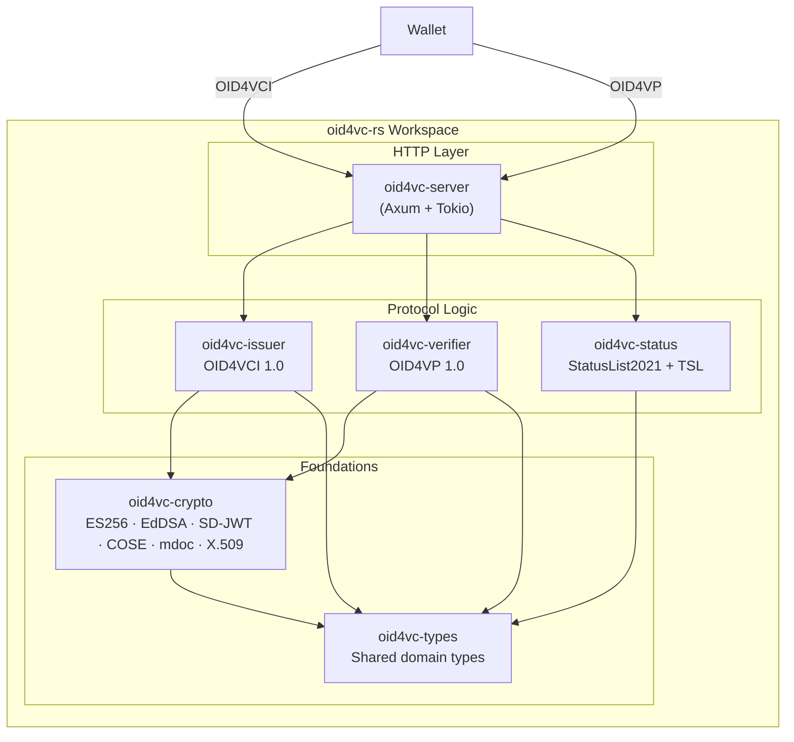

# oid4vc-rs

A Rust implementation of **OpenID for Verifiable Credential Issuance (OID4VCI 1.0)** and **OpenID for Verifiable Presentations (OID4VP 1.0)**, built with Axum and Tokio.

[](https://github.com/itsahmadyaseen/oid4vc-rs/actions/workflows/ci.yml)


---

## Conformance Results

The issuer was run against the [OpenID Foundation conformance suite](https://gitlab.com/openid/conformance-suite)
v5.3.1, self-hosted. Plan: `oid4vci-1_0-issuer-haip-test-plan`, 63 test modules
per variant, once for each credential format.

| Test Plan | Format | Variant | Date | Passed | Review | Skipped | Failed |
|-----------|--------|---------|------|--------|--------|---------|--------|
| OID4VCI 1.0 Issuer, HAIP 1.0 | SD-JWT VC | wallet-initiated authorization code | 2026-09-25 | 55 | 2 | 6 | 0 |
| OID4VCI 1.0 Issuer, HAIP 1.0 | SD-JWT VC | issuer-initiated authorization code | 2026-09-25 | 55 | 2 | 6 | 0 |
| OID4VCI 1.0 Issuer, HAIP 1.0 | mdoc (mDL) | wallet-initiated authorization code | 2026-09-26 | 55 | 2 | 6 | 0 |
| OID4VCI 1.0 Issuer, HAIP 1.0 | mdoc (mDL) | issuer-initiated authorization code | 2026-09-26 | 55 | 2 | 6 | 0 |
| OID4VP 1.0 Verifier, HAIP 1.0 | — | — | *not yet run* | — | — | — | — |

The same modules land in review and skipped for both formats:

- **Review** — `…-without-using-par-fails` and `…-request_uri-for-different-client`.
  The issuer refuses these requests with an error page rather than redirecting,
  since it cannot trust the redirect URI. The suite captures that page for a
  human reviewer, which is the expected outcome.
- **Skipped** — signed issuer metadata and key attestation (optional, not
  implemented), refresh tokens (none are issued), and the three modules of the
  encrypted variant (credential request/response encryption is not implemented).
- Two modules need a different scripted browser, as their descriptions ask:
  `…-user-rejects-authentication` clicks *Deny*, and
  `…-reused-request-uri-prior-to-auth-completion-succeeds` takes no action on the
  first visit. They were run on their own with those scripts, and both pass.
- For the mDL, the suite also checks the credential itself, and every check
  passes with no warnings: the MSO signature and each element's digest, the
  document signer and IACA certificate profiles (ISO/IEC 18013-5 Annex B),
  `issuing_country` against the certificate, the MSO validity period, the
  device key against the proof key, every mandatory mDL element and its
  encoding, `age_over_NN` against `birth_date`, and the signed revocation list
  and its certificate chain. In a batch, all copies carry the same data and no
  precise timestamp. The IACA root is given to the suite directly, not through a
  VICAL, so the suite's VICAL checks do not run.

These are self-run results, not an OpenID Foundation certification. The run
harness is in [`conformance/`](conformance/), so they can be reproduced.

The full issue → present → verify loop is also covered end to end over the real
HTTP router in `crates/server/tests/e2e.rs`.

---

## Architecture



---

## Supported Formats

| Format | Status | Spec |
|--------|--------|------|
| **SD-JWT VC** | ✅ Implemented | [RFC 9901](https://datatracker.ietf.org/doc/rfc9901/) |
| **ISO 18013-5 mdoc** (mDL) | ✅ Issued over OID4VCI; presentation and verification in `oid4vc-crypto`, not yet wired into the verifier endpoint | [ISO/IEC 18013-5](https://www.iso.org/standard/69084.html) |
| JWT-VC | ○ Planned | [W3C VC Data Model](https://www.w3.org/TR/vc-data-model-2.0/) |

---

## Spec Versions

| Specification | Version |
|---------------|---------|
| OpenID4VCI | [1.0](https://openid.net/specs/openid-4-verifiable-credential-issuance-1_0.html) |
| OpenID4VP | [1.0](https://openid.net/specs/openid-4-verifiable-presentations-1_0.html) |
| HAIP | [1.0](https://openid.net/specs/openid4vc-high-assurance-interoperability-profile-1_0.html) |
| FAPI 2.0 Security Profile | [Final](https://openid.net/specs/fapi-security-profile-2_0-final.html) |
| DPoP | [RFC 9449](https://datatracker.ietf.org/doc/rfc9449/) |
| PAR | [RFC 9126](https://datatracker.ietf.org/doc/rfc9126/) |
| Attestation-Based Client Authentication | [draft-ietf-oauth-attestation-based-client-auth](https://datatracker.ietf.org/doc/draft-ietf-oauth-attestation-based-client-auth/) |
| SD-JWT | [RFC 9901](https://datatracker.ietf.org/doc/rfc9901/) |
| mdoc, mDL | [ISO/IEC 18013-5:2021](https://www.iso.org/standard/69084.html), with OID4VCI 1.0 Appendix A.2 and OID4VP 1.0 Appendix B.2 |
| COSE | [RFC 9052](https://datatracker.ietf.org/doc/rfc9052/) |
| DCQL | OID4VP 1.0 §5.3 |
| StatusList2021 | [W3C v1.0](https://www.w3.org/TR/vc-status-list/) |
| Token Status List | [draft-ietf-oauth-status-list](https://datatracker.ietf.org/doc/draft-ietf-oauth-status-list/) |

---

## Quickstart

### Run locally

```bash
# Clone
git clone https://github.com/itsahmadyaseen/oid4vc-rs.git
cd oid4vc-rs

# Build and run
cargo run --bin oid4vc-server

# Discovery
curl http://localhost:3000/.well-known/openid-credential-issuer | jq .
curl http://localhost:3000/.well-known/oauth-authorization-server | jq .
```

### Walk the issuance flow

```bash
# 1. Get an offer with a pre-authorized code
CODE=$(curl -s localhost:3000/credential_offer \
  | jq -r '.credential_offer.grants["urn:ietf:params:oauth:grant-type:pre-authorized_code"]["pre-authorized_code"]')

# 2. Exchange it for an access token (form-encoded, per OAuth 2.0)
curl -s -X POST localhost:3000/token \
  -H 'content-type: application/x-www-form-urlencoded' \
  --data-urlencode 'grant_type=urn:ietf:params:oauth:grant-type:pre-authorized_code' \
  --data-urlencode "pre-authorized_code=$CODE" | jq .

# 3. Fetch a fresh c_nonce from the Nonce Endpoint (OID4VCI §7)
curl -s -X POST localhost:3000/nonce | jq .
```

Step 4 — `POST /credential` with `credential_configuration_id` and
`proofs.jwt[]` — needs a proof-of-possession JWT signed over that `c_nonce`, so
it is not a one-liner in `curl`. The credential endpoint verifies that
signature, so a hand-written proof is rejected. See `crates/server/tests/e2e.rs`
for a wallet that does it properly, including the HAIP authorization code flow
with PAR, client attestation and DPoP.

### Configuration

| Variable | Default | Purpose |
|----------|---------|---------|
| `SERVER_HOST` / `SERVER_PORT` | `0.0.0.0` / `3000` | Listen address |
| `EXTERNAL_URL` | `http://localhost:{port}` | Credential Issuer identifier; the `aud` wallets must use |
| `ISSUER_KEY_P256_PEM` | *(unset)* | P-256 signing key, created on first start. Unset means ephemeral keys, and credentials stop verifying after a restart |
| `ISSUER_KEY_ED25519_PEM` | *(unset)* | Ed25519 signing key |
| `ISSUER_CERT_PEM` | *(unset)* | The P-256 key's certificates, as one PEM bundle: the `x5c` leaf for SD-JWT VCs and their status lists, the mdoc document signer, the mdoc revocation list signer, the root they chain to, and the root's CRL. If the file is missing, a development root and all of these are minted and written here |
| `ISSUER_TRUST_ANCHOR_PEM` | *(unset)* | Where a minted development root is written, for relying parties to trust. It is also the mdoc IACA root. Unset means it is printed to the log |
| `CLIENT_ATTESTER_JWKS` | *(unset)* | JWKS of trusted wallet attesters. The authorization code flow requires OAuth 2.0 Attestation-Based Client Authentication, so unset means every wallet is rejected there |
| `ADMIN_API_TOKEN` | *(generated)* | Bearer token for `/admin/status/*`. A generated one is written to the log at startup |
| `CREDENTIAL_ISSUER_NAME` | `OID4VC-RS Development Issuer` | Display name in metadata |

### Docker

```bash
docker compose up -d
curl http://localhost:3000/.well-known/openid-credential-issuer | jq .
```

---

## API Endpoints

### Issuer (OID4VCI)

| Method | Path | Description |
|--------|------|-------------|
| `GET` | `/.well-known/openid-credential-issuer` | Credential Issuer Metadata |
| `GET` | `/.well-known/oauth-authorization-server` | Authorization Server Metadata (RFC 8414) |
| `GET` | `/.well-known/jwks.json` | JSON Web Key Set |
| `GET` | `/credentials/identity` | SD-JWT VC Type Metadata, resolvable from the credential's `vct` |
| `POST` | `/authorize/par` | Pushed Authorization Request (client attestation required) |
| `GET` | `/authorize` | Authorization endpoint — shows the consent page for a pushed request |
| `POST` | `/authorize/decision` | Consent decision — redirects to the wallet with a code or `access_denied` |
| `POST` | `/token` | Token endpoint (auth code + pre-auth code), DPoP-bound tokens |
| `POST` | `/nonce` | Nonce endpoint — a fresh single-use `c_nonce` |
| `POST` | `/credential` | Credential endpoint (SD-JWT VC, mdoc), batch via `proofs.jwt[]` |
| `GET` | `/credential_offer` | Generate a credential offer; `?credential_configuration_id=mDL_mso_mdoc` offers the mDL |

The OAuth endpoints (`/authorize/par`, `/token`) and `direct_post`
(`/verifier/response`) accept `application/x-www-form-urlencoded`, which is what
the specs require, and also accept JSON for convenience.

### Verifier (OID4VP)

| Method | Path | Description |
|--------|------|-------------|
| `POST` | `/verifier/authorize` | Create authorization request |
| `GET` | `/verifier/request/{id}` | Serve request as JWT (`request_uri`) |
| `POST` | `/verifier/response` | Receive VP token (`direct_post`) |

### Status

| Method | Path | Description |
|--------|------|-------------|
| `GET` | `/status/{id}` | Serve StatusList2021 credential |
| `GET` | `/status/{id}/token` | Serve IETF Token Status List as a signed `statuslist+jwt` |
| `GET` | `/status/mdoc` | Serve the mdoc revocation list: a Status List Token in CWT format (`application/statuslist+cwt`) |
| `GET` | `/iaca.crl` | Serve the root's CRL, named by the mdoc document signer certificate |
| `POST` | `/admin/status/revoke` | Revoke a credential; send `"format": "mso_mdoc"` for an mdoc *(requires `ADMIN_API_TOKEN`)* |
| `POST` | `/admin/status/suspend` | Suspend a credential *(requires `ADMIN_API_TOKEN`)* |
| `POST` | `/admin/status/reinstate` | Reinstate a credential *(requires `ADMIN_API_TOKEN`)* |

Issued SD-JWT VCs carry a `status.status_list` claim pointing at
`/status/revocation/token`, so a revocation actually applies to a specific
credential rather than to an unallocated index. Indices are allocated at random,
so two credentials cannot be linked by consecutive positions in the list.

Issued mdocs carry the MSO `status.status_list` entry instead, pointing at
`/status/mdoc`. ISO/IEC 18013-5 requires that list to have one bit per mdoc, so
it is separate from the 2-bit lists above, and an mdoc can be revoked but not
suspended.

---

## Crate Structure

```
oid4vc-rs/
├── crates/
│   ├── types/       # Shared domain types (OID4VCI, OID4VP, credentials, status, errors)
│   ├── crypto/      # ECDSA P-256, Ed25519, JWS, SD-JWT, COSE, mdoc, X.509, JWK
│   ├── issuer/      # OID4VCI issuer logic (metadata, offer, auth, token, credential)
│   ├── verifier/    # OID4VP verifier logic (request, response, DCQL, session)
│   ├── status/      # StatusList2021 + IETF Token Status List management
│   └── server/      # Axum HTTP server tying everything together
├── crates/server/tests/e2e.rs   # End-to-end HTTP tests
├── .github/workflows/ci.yml
├── Dockerfile
├── docker-compose.yml
└── README.md
```

---

## Security Properties

These are enforced and covered by tests, including negative tests:

| Property | Where |
|----------|-------|
| Proof-of-possession signatures are verified against the key in the JWT header | `issuer/credential.rs` |
| Proof `aud` must be this issuer, and `iat` must be recent | `issuer/credential.rs` |
| `c_nonce` is single-use and time-limited | `issuer/state.rs` |
| Issued credentials are key-bound via `cnf`, not bearer tokens | `issuer/credential.rs` |
| Presentations require a valid KB-JWT signed by the `cnf` key | `crypto/sd_jwt.rs` |
| KB-JWT `nonce` and `aud` are checked, and `sd_hash` covers the disclosures | `crypto/sd_jwt.rs` |
| Verifier sessions are single-use, so a presentation cannot be replayed | `verifier/response.rs` |
| The DCQL query is evaluated — a presentation missing a requested claim is rejected | `verifier/response.rs` |
| PKCE `S256` is required on the authorization code flow | `issuer/authorization.rs` |
| The authorization code flow requires PAR; a `request_uri` is bound to its client, expires after 60 s, and is single-use | `issuer/authorization.rs`, `server/routes/issuer.rs` |
| Wallets authenticate with OAuth 2.0 Attestation-Based Client Authentication; the attestation must come from a trusted attester and the PoP must be signed by its `cnf` key, with `jti` replay rejected | `issuer/client_attestation.rs` |
| Access tokens are sender-constrained with DPoP (RFC 9449): `htm`/`htu`/`iat`/`ath` checked, `jti` replay rejected, key bound across PAR (`dpop_jkt`), token and credential requests | `issuer/dpop.rs`, `issuer/token.rs` |
| Authorization codes live 60 s, are bound to client and `redirect_uri`, and a replayed code revokes the tokens it minted | `issuer/token.rs` |
| The authorization response carries `iss` (RFC 9207) | `server/routes/issuer.rs` |
| Credentials and status list tokens carry an `x5c` chain; the trust anchor is left out, per HAIP | `crypto/x509.rs` |
| An mdoc's MSO names the proof key as its device key, so only the holder can present it | `issuer/credential.rs` |
| Every mdoc element is covered by a salted SHA-256 digest in the signed MSO, under random digest IDs; a verifier re-hashes each revealed element | `crypto/mdoc.rs` |
| An mdoc presentation is signed by the device key over the OID4VP session transcript (`client_id`, `nonce`, `response_uri`), so it cannot be replayed to another request | `crypto/mdoc.rs` |
| The MSO is signed under a document signer certificate following ISO/IEC 18013-5 Annex B, which chains to an IACA root and outlives every MSO it signs | `crypto/x509.rs`, `issuer/credential.rs` |
| Credential time claims are rounded to the day (RFC 9901 §10.1), so batch-issued credentials cannot be correlated by timestamp | `crypto/sd_jwt.rs` |
| Admin status endpoints require a bearer token, compared in constant time | `server/routes/status.rs` |

## What's Deliberately Not Implemented (and Why)

| Feature | Rationale |
|---------|-----------|
| **DID resolution** | This is a credential format + protocol implementation, not a DID method. Use `did-method-*` crates alongside this. |
| **Wallet implementation** | Out of scope — this is the *issuer* and *verifier* side. Use the conformance suite's wallet emulator for testing. |
| **Database persistence** | State management uses traits (`IssuerState`, `VerifierState`). The in-memory implementation ships by default; plug in PostgreSQL/Redis for production. |
| **TLS termination** | Use a reverse proxy (nginx, Caddy) in production. The server listens on plain HTTP. |
| **User authentication at `/authorize`** | The authorization endpoint collects consent but does not log a user in. Authenticating the holder belongs to the deployment's IdP. |
| **Issuer trust resolution** | The verifier verifies against this server's own issuer key. Resolving an arbitrary issuer via `did:web`/`x5c` and a trust list is not implemented. |
| **Credential response encryption** | Not implemented, so the conformance suite's encrypted-response variant does not apply. |

---

## Running Tests

```bash
# All tests, including the end-to-end HTTP suite
cargo test --all

# The end-to-end suite on its own: issue → present → verify over the real router
cargo test -p oid4vc-server --test e2e

# Specific crate
cargo test -p oid4vc-crypto
cargo test -p oid4vc-issuer
cargo test -p oid4vc-status
```

`crates/server/tests/e2e.rs` builds the same router `main` serves, so a
malformed route or a broken handler fails the build rather than only showing up
at runtime.

---

## License

Licensed under either of:

- Apache License, Version 2.0 ([LICENSE-APACHE](LICENSE-APACHE))
- MIT License ([LICENSE-MIT](LICENSE-MIT))

at your option.
