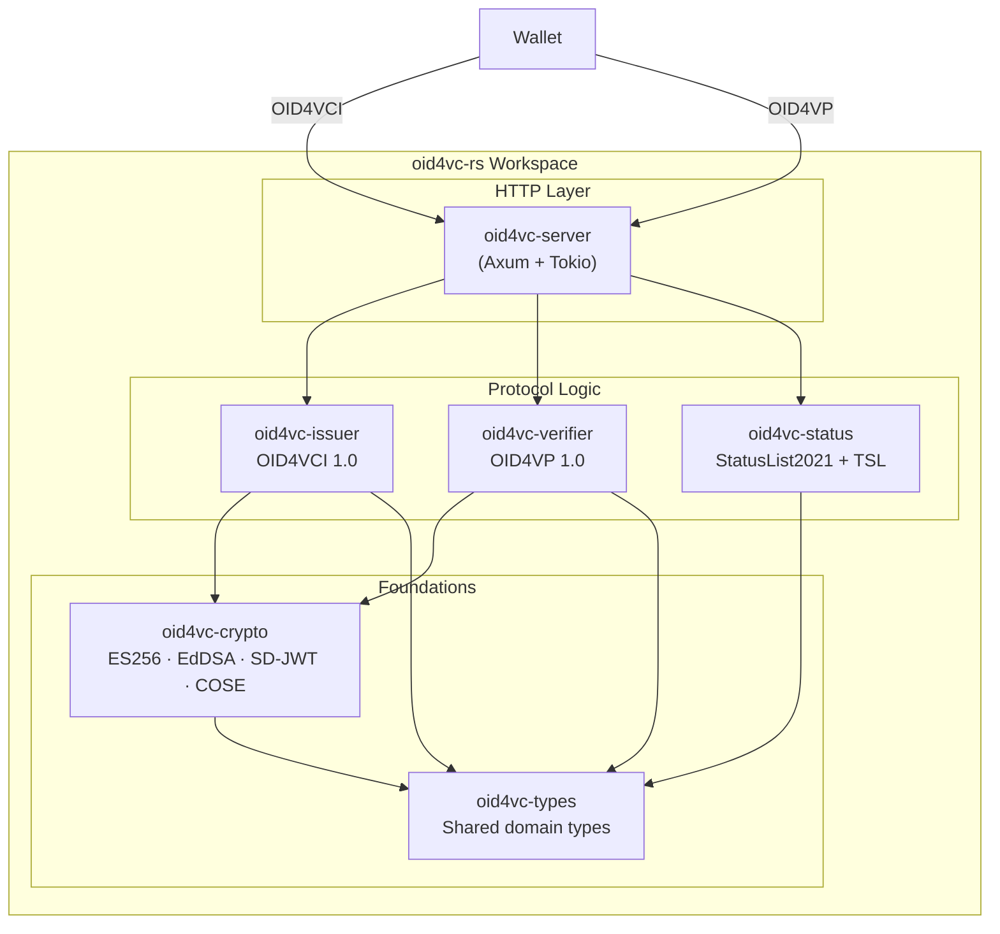

# oid4vc-rs

A Rust implementation of **OpenID for Verifiable Credential Issuance (OID4VCI 1.0)** and **OpenID for Verifiable Presentations (OID4VP 1.0)**, built with Axum and Tokio.

[](https://github.com/itsahmadyaseen/oid4vc-rs/actions/workflows/ci.yml)


---

## Conformance Results

> **Status: not yet run against the conformance suite.**

| Test Plan | Spec Version | Profile | Date | Pass | Fail |
|-----------|-------------|---------|------|------|------|
| OID4VCI Issuer | 1.0 | HAIP 1.0 | *not yet run* | — | — |
| OID4VP Verifier | 1.0 | HAIP 1.0 | *not yet run* | — | — |

This table will be filled in after running against the [OpenID Foundation conformance suite](https://www.certification.openid.net/). No conformance claim is made until then, and this implementation is **not** OpenID certified.

What *is* verified today is the full issue → present → verify loop, end to end over the real HTTP router, in `crates/server/tests/e2e.rs`.

---

## Architecture



---

## Supported Formats

| Format | Status | Spec |
|--------|--------|------|
| **SD-JWT VC** | ✅ Implemented | [RFC 9901](https://datatracker.ietf.org/doc/rfc9901/) |
| **ISO 18013-5 mdoc** | ◐ Partial — COSE_Sign1 + MSO digests | [ISO/IEC 18013-5](https://www.iso.org/standard/69084.html) |
| JWT-VC | ○ Planned | [W3C VC Data Model](https://www.w3.org/TR/vc-data-model-2.0/) |

---

## Spec Versions

| Specification | Version |
|---------------|---------|
| OpenID4VCI | [1.0](https://openid.net/specs/openid-4-verifiable-credential-issuance-1_0.html) |
| OpenID4VP | [1.0](https://openid.net/specs/openid-4-verifiable-presentations-1_0.html) |
| HAIP | [1.0](https://openid.net/specs/openid4vc-high-assurance-interoperability-profile-1_0.html) |
| SD-JWT | [RFC 9901](https://datatracker.ietf.org/doc/rfc9901/) |
| DCQL | OID4VP 1.0 §5.3 |
| StatusList2021 | [W3C v1.0](https://www.w3.org/TR/vc-status-list/) |
| Token Status List | [draft-ietf-oauth-status-list](https://datatracker.ietf.org/doc/draft-ietf-oauth-status-list/) |

---

## Quickstart

### Run locally

```bash
# Clone
git clone https://github.com/itsahmadyaseen/oid4vc-rs.git
cd oid4vc-rs

# Build and run
cargo run --bin oid4vc-server

# Discovery
curl http://localhost:3000/.well-known/openid-credential-issuer | jq .
curl http://localhost:3000/.well-known/oauth-authorization-server | jq .
```

### Walk the issuance flow

```bash
# 1. Get an offer with a pre-authorized code
CODE=$(curl -s localhost:3000/credential_offer \
  | jq -r '.credential_offer.grants["urn:ietf:params:oauth:grant-type:pre-authorized_code"]["pre-authorized_code"]')

# 2. Exchange it for an access token and c_nonce (form-encoded, per OAuth 2.0)
curl -s -X POST localhost:3000/token \
  -H 'content-type: application/x-www-form-urlencoded' \
  --data-urlencode 'grant_type=urn:ietf:params:oauth:grant-type:pre-authorized_code' \
  --data-urlencode "pre-authorized_code=$CODE" | jq .
```

Step 3 — `POST /credential` — needs a signed proof-of-possession JWT, so it is
not a one-liner in `curl`. The credential endpoint verifies that signature, so a
hand-written proof is rejected. See `crates/server/tests/e2e.rs` for a wallet
that does it properly.

### Configuration

| Variable | Default | Purpose |
|----------|---------|---------|
| `SERVER_HOST` / `SERVER_PORT` | `0.0.0.0` / `3000` | Listen address |
| `EXTERNAL_URL` | `http://localhost:{port}` | Credential Issuer identifier; the `aud` wallets must use |
| `ISSUER_KEY_P256_PEM` | *(unset)* | P-256 signing key, created on first start. Unset means ephemeral keys, and credentials stop verifying after a restart |
| `ISSUER_KEY_ED25519_PEM` | *(unset)* | Ed25519 signing key |
| `ADMIN_API_TOKEN` | *(generated)* | Bearer token for `/admin/status/*`. A generated one is written to the log at startup |
| `CREDENTIAL_ISSUER_NAME` | `OID4VC-RS Development Issuer` | Display name in metadata |

### Docker

```bash
docker compose up -d
curl http://localhost:3000/.well-known/openid-credential-issuer | jq .
```

---

## API Endpoints

### Issuer (OID4VCI)

| Method | Path | Description |
|--------|------|-------------|
| `GET` | `/.well-known/openid-credential-issuer` | Credential Issuer Metadata |
| `GET` | `/.well-known/oauth-authorization-server` | Authorization Server Metadata (RFC 8414) |
| `GET` | `/.well-known/jwks.json` | JSON Web Key Set |
| `POST` | `/authorize/par` | Pushed Authorization Request |
| `GET` | `/authorize` | Authorization endpoint — issues the code, redirects to the wallet |
| `POST` | `/token` | Token endpoint (auth code + pre-auth code) |
| `POST` | `/credential` | Credential endpoint (SD-JWT VC, mdoc) |
| `GET` | `/credential_offer` | Generate a credential offer |

The OAuth endpoints (`/authorize/par`, `/token`) and `direct_post`
(`/verifier/response`) accept `application/x-www-form-urlencoded`, which is what
the specs require, and also accept JSON for convenience.

### Verifier (OID4VP)

| Method | Path | Description |
|--------|------|-------------|
| `POST` | `/verifier/authorize` | Create authorization request |
| `GET` | `/verifier/request/{id}` | Serve request as JWT (`request_uri`) |
| `POST` | `/verifier/response` | Receive VP token (`direct_post`) |

### Status

| Method | Path | Description |
|--------|------|-------------|
| `GET` | `/status/{id}` | Serve StatusList2021 credential |
| `GET` | `/status/{id}/token` | Serve IETF Token Status List |
| `POST` | `/admin/status/revoke` | Revoke a credential *(requires `ADMIN_API_TOKEN`)* |
| `POST` | `/admin/status/suspend` | Suspend a credential *(requires `ADMIN_API_TOKEN`)* |
| `POST` | `/admin/status/reinstate` | Reinstate a credential *(requires `ADMIN_API_TOKEN`)* |

Issued SD-JWT VCs carry a `status.status_list` claim pointing at
`/status/revocation/token`, so a revocation actually applies to a specific
credential rather than to an unallocated index.

---

## Crate Structure

```
oid4vc-rs/
├── crates/
│   ├── types/       # Shared domain types (OID4VCI, OID4VP, credentials, status, errors)
│   ├── crypto/      # ECDSA P-256, Ed25519, JWS, SD-JWT, COSE_Sign1, JWK
│   ├── issuer/      # OID4VCI issuer logic (metadata, offer, auth, token, credential)
│   ├── verifier/    # OID4VP verifier logic (request, response, DCQL, session)
│   ├── status/      # StatusList2021 + IETF Token Status List management
│   └── server/      # Axum HTTP server tying everything together
├── crates/server/tests/e2e.rs   # End-to-end HTTP tests
├── .github/workflows/ci.yml
├── Dockerfile
├── docker-compose.yml
└── README.md
```

---

## Security Properties

These are enforced and covered by tests, including negative tests:

| Property | Where |
|----------|-------|
| Proof-of-possession signatures are verified against the key in the JWT header | `issuer/credential.rs` |
| Proof `aud` must be this issuer, and `iat` must be recent | `issuer/credential.rs` |
| `c_nonce` is single-use and time-limited | `issuer/state.rs` |
| Issued credentials are key-bound via `cnf`, not bearer tokens | `issuer/credential.rs` |
| Presentations require a valid KB-JWT signed by the `cnf` key | `crypto/sd_jwt.rs` |
| KB-JWT `nonce` and `aud` are checked, and `sd_hash` covers the disclosures | `crypto/sd_jwt.rs` |
| Verifier sessions are single-use, so a presentation cannot be replayed | `verifier/response.rs` |
| The DCQL query is evaluated — a presentation missing a requested claim is rejected | `verifier/response.rs` |
| PKCE `S256` is required on the authorization code flow | `issuer/authorization.rs` |
| Admin status endpoints require a bearer token, compared in constant time | `server/routes/status.rs` |

## What's Deliberately Not Implemented (and Why)

| Feature | Rationale |
|---------|-----------|
| **DID resolution** | This is a credential format + protocol implementation, not a DID method. Use `did-method-*` crates alongside this. |
| **Wallet implementation** | Out of scope — this is the *issuer* and *verifier* side. Use the conformance suite's wallet emulator for testing. |
| **Database persistence** | State management uses traits (`IssuerState`, `VerifierState`). The in-memory implementation ships by default; plug in PostgreSQL/Redis for production. |
| **TLS termination** | Use a reverse proxy (nginx, Caddy) in production. The server listens on plain HTTP. |
| **User authentication at `/authorize`** | The authorization endpoint grants immediately instead of authenticating a user and collecting consent. That belongs to the deployment's IdP. |
| **Issuer trust resolution** | The verifier verifies against this server's own issuer key. Resolving an arbitrary issuer via `did:web`/`x5c` and a trust list is not implemented. |
| **Batch credential issuance** | Spec-compliant but not yet implemented. Single credential per request for now. |

---

## Running Tests

```bash
# All tests, including the end-to-end HTTP suite
cargo test --all

# The end-to-end suite on its own: issue → present → verify over the real router
cargo test -p oid4vc-server --test e2e

# Specific crate
cargo test -p oid4vc-crypto
cargo test -p oid4vc-issuer
cargo test -p oid4vc-status
```

`crates/server/tests/e2e.rs` builds the same router `main` serves, so a
malformed route or a broken handler fails the build rather than only showing up
at runtime.

---

## License

Licensed under either of:

- Apache License, Version 2.0 ([LICENSE-APACHE](LICENSE-APACHE))
- MIT License ([LICENSE-MIT](LICENSE-MIT))

at your option.
